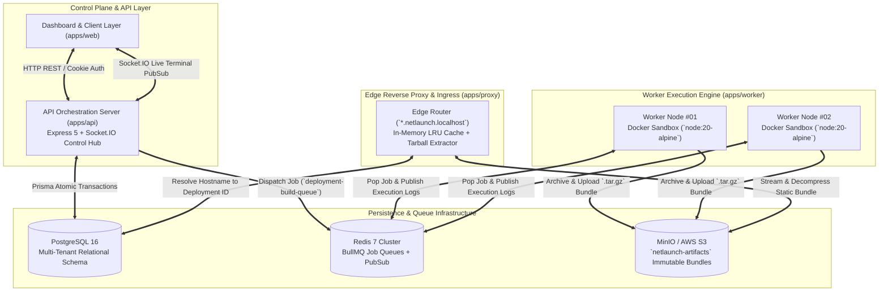

# NetLaunch — Distributed Cloud Deployment Engine & Edge Ingress Control Plane

[](https://turbo.build)
[](https://www.typescriptlang.org/)
[](https://www.docker.com/)
[](https://redis.io/)
[](https://min.io/)
[](https://www.postgresql.org/)

**NetLaunch** is a production-grade, distributed cloud deployment and edge routing engine modeled after the core architectural principles of **Vercel, Netlify, Railway, and GitHub Actions**. 

Rather than relying on monolithic deployment scripts, NetLaunch decouples the system into distinct control plane APIs, asynchronous queue brokers, containerized worker sandboxes, immutable object storage buckets, and high-performance edge reverse proxies. Every component is designed to handle high concurrency, multi-tenant isolation, and zero-downtime routing.

---

## 🏗️ Core Systems & Distributed Architecture



---

## ⚙️ Technical Mechanics & Subsystems

### 1. Ephemeral Containerized Build Sandboxes (`apps/worker`)
- **Docker Engine Isolation**: Every deployment request executes inside an ephemeral, non-root Docker container (`node:20-alpine`). This guarantees complete filesystem and environment variable isolation, preventing cross-tenant contamination and noisy-neighbor resource leaks.
- **Universal Framework Resolution**: The build worker automatically detects and extracts production artifacts across modern framework conventions (`dist/`, `.next/`, `build/`, and `out/`).
- **Immutable Artifact Bundling**: Upon completion, the worker packages the static build output into an immutable `.tar.gz` tarball (`{deploymentId}.tar.gz`) and streams it directly into **MinIO S3 Object Storage**.

### 2. Asynchronous Queue Orchestration (`BullMQ + Redis 7`)
- **Decoupled API & Worker Planes**: Incoming deployment triggers (`POST /api/v1/projects/:id/deploy`) do not block HTTP request threads. Instead, tasks are pushed to a high-concurrency Redis queue (`deployment-build-queue`).
- **Automatic Retries & Exponential Backoff**: BullMQ workers process jobs with configurable concurrency limits, automatic backoff handling for network hiccups, and dead-letter queue isolation for persistent build failures.
- **Distributed PubSub Log Streaming**: As the Docker build container outputs `stdout` and `stderr`, workers publish log chunks over Redis PubSub (`deployment:logs:{deploymentId}`). The control plane (`apps/api`) subscribes to these channels and multiplexes them across WebSocket connections (`Socket.IO`) for low-latency terminal viewing.

### 3. Edge Reverse Proxy & Ingress Engine (`apps/proxy`)
- **Wildcard Subdomain Routing (`*.netlaunch.localhost`)**: The custom HTTP reverse proxy intercepts incoming web traffic, extracts the target subdomain, and queries PostgreSQL to resolve the active `Deployment` ID.
- **On-the-Fly S3 Extraction & LRU Caching**: When a request arrives, the proxy fetches the corresponding `.tar.gz` bundle from MinIO, decompresses files into an in-memory `lru-cache`, and serves static assets with exact MIME types and caching headers (`Cache-Control: public, max-age=31536000`).
- **Single-Page Application (SPA) Fallback**: Automatically falls back to serving `index.html` for client-side routing when nested file paths are not found in the tarball.

### 4. Least-Privilege GitHub Security Architecture (`apps/api`)
- **Fine-Grained GitHub Apps**: Instead of requesting global OAuth scopes across a user's entire GitHub account, NetLaunch integrates via fine-grained GitHub Apps (`/github/install`).
- **Rotating Cryptographic Access Tokens**: The backend signs RS256 JSON Web Tokens using a private RSA key (`GITHUB_APP_PRIVATE_KEY`) to exchange for short-lived 1-hour Installation Access Tokens (`IAT`), ensuring least-privilege repository access during the git clone step.

---

## 📦 Monorepo Workspace Organization

NetLaunch uses **Turborepo** and **pnpm workspaces** to enforce clear boundaries between services, shared database schemas, and configuration packages:

```
netlaunch/
├── apps/
│   ├── api/                 # Express 5 + TypeScript + Socket.IO Control Plane
│   ├── worker/              # BullMQ Consumer + Docker Container Engine + MinIO Archiver
│   ├── proxy/               # Edge Reverse Proxy + Subdomain Router + S3 Tarball Extractor
│   └── web/                 # Next.js 15 (App Router) Control Plane Dashboard
├── packages/
│   ├── database/            # Prisma Multi-Tenant Schema, Migrations, Seeders & Client
│   ├── shared/              # Shared Zod Schemas, Data Transfer Objects & Type Definitions
│   ├── ui/                  # Reusable UI Primitives and Component Tokens
│   └── config/              # Base TypeScript and ESLint configuration sets
├── docs/
│   └── reference/           # Architectural deep-dive documentation series
└── infrastructure/
    └── docker-compose.yml   # Local development infrastructure (PostgreSQL, Redis, MinIO)
```

---

## 🛠️ Quickstart & Local Infrastructure

### Prerequisites
- **Node.js**: `v20.x` or higher
- **pnpm**: `v9.x` (`npm install -g pnpm`)
- **Docker & Docker Compose**: Required for running PostgreSQL, Redis, MinIO, and build workers

### 1. Clone & Install Workspace Dependencies
```bash
git clone https://github.com/M-ayank2005/NetLaunch.git
cd NetLaunch
pnpm install
```

### 2. Launch Infrastructure Services (PostgreSQL, Redis, MinIO)
Boot the persistence layer in background Docker containers:
```bash
cd infrastructure
docker compose up -d
cd ..
```
*Note: The `netlaunch-minio-init` container runs once to initialize the `netlaunch-artifacts` and `netlaunch-logs` S3 buckets and exits cleanly with code `0`.*

### 3. Synchronize Database Schema & Seed Mock Data
Push the relational schema to PostgreSQL and populate initial demo tenants:
```bash
pnpm --filter @netlaunch/database db:push
pnpm --filter @netlaunch/database db:seed
```

### 4. Run All Services Simultaneously (`Control Plane + Worker + Proxy`)
Start the complete distributed ecosystem using Turborepo concurrency:
```bash
pnpm turbo run dev
```

| Service | Port | Description |
| :--- | :--- | :--- |
| **Control Plane Dashboard** | `http://localhost:3000` | Management UI for project configurations and build logs |
| **Control Plane API Server** | `http://localhost:4000` | REST endpoints, OAuth verification, and Socket.IO hub |
| **Edge Reverse Proxy** | `http://localhost:8080` | Ingress router for deployed wildcard web applications |
| **MinIO S3 Console** | `http://localhost:9001` | Object storage admin view (`netlaunch_minio_admin` / `netlaunch_minio_secret_2026`) |

---

## 📚 Technical Reference Library

Explore our comprehensive engineering deep-dives detailing the internal mechanics of each subsystem:

1. **[Monorepo Architecture & Infrastructure](file:///C:/Projects/NetLaunch/docs/reference/01-monorepo-and-infrastructure.md)** — Workspace isolation, build caching, and Docker orchestration.
2. **[Database Design & Relational Modeling](file:///C:/Projects/NetLaunch/docs/reference/02-database-and-prisma-schema.md)** — Multi-tenancy transactions, indexing strategies, and relational integrity.
3. **[GitHub OAuth & Stateless Authentication](file:///C:/Projects/NetLaunch/docs/reference/03-github-oauth-and-jwt-authentication.md)** — Cryptographic cookie verification and token exchange mechanics.
4. **[GitHub App Integration & RSA Token Rotation](file:///C:/Projects/NetLaunch/docs/reference/04-github-app-and-project-apis.md)** — Installation access tokens (`IAT`) and least-privilege repository cloning.
5. **[Control Plane & Real-Time Log Architecture](file:///C:/Projects/NetLaunch/docs/reference/05-glassmorphism-dashboard-and-repo-selection.md)** — WebSocket multiplexing and terminal stream processing.

---

## 📝 License
MIT License © 2026 NetLaunch Engineering Team.
