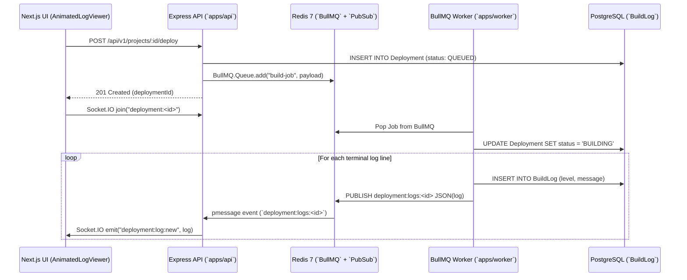

# 06. BullMQ Worker Engine & Redis PubSub Real-Time Streaming

## 1. Theory
In distributed cloud platforms (Vercel, Railway, GitHub Actions), control plane APIs (`apps/api`) should never execute CPU-intensive build jobs synchronously. Blocking an HTTP request loop for a 3-minute `vite build` or `next build` causes thread pool exhaustion, API timeouts, and cascading failure. Instead, the control plane acts as a producer, pushing lightweight job payloads to a persistent message queue (`BullMQ` backed by Redis). Isolated background worker nodes (`apps/worker`) act as consumers, pulling jobs asynchronously and publishing terminal logs in real-time over Redis PubSub.

## 2. Internal Working
When a user triggers a deployment (`POST /api/v1/projects/:id/deploy`), `apps/api` creates a `Deployment` record in PostgreSQL (`QUEUED`) and calls `queueDeploymentJob(deploymentId, projectId, userId)` which adds a job to the `deployment-build-queue` inside Redis.
`apps/worker` runs a `BullMQ.Worker` instance listening to `deployment-build-queue`. When a worker becomes idle, it pops the job, marks the `Deployment` as `BUILDING`, and begins container execution. As terminal lines (`stdout`/`stderr`) are emitted from the build sandbox, `workerLogger.log()` records the line in `BuildLog` and publishes a JSON payload to `deployment:logs:<deploymentId>`. `apps/api` subscribes (`psubscribe`) to `deployment:logs:*` and immediately relays the event over WebSocket (`Socket.IO`) to the connected user's browser.

## 3. Architecture


## 4. Database Design
The `BuildLog` table uses a composite index to ensure sub-millisecond querying when users refresh or open past deployments:
```prisma
model BuildLog {
  id           String     @id @default(uuid())
  deploymentId String
  deployment   Deployment @relation(fields: [deploymentId], references: [id], onDelete: Cascade)
  timestamp    DateTime   @default(now())
  level        String     @default("INFO") // INFO, WARN, ERROR, COMMAND
  message      String
  
  @@index([deploymentId, timestamp])
}
```

## 5. APIs & Queue Contracts
### Queue Name
- `deployment-build-queue`

### Job Payload (`DeploymentJobPayload`)
```typescript
export interface DeploymentJobPayload {
  deploymentId: string;
  projectId: string;
  userId: string;
}
```

## 6. Code Structure
- **`apps/worker/src/index.ts`**: Initializes `BullMQ.Worker` with concurrency options and error handling.
- **`apps/worker/src/services/logger.ts`**: Encapsulates atomic database writes (`prisma.buildLog.create`) alongside Redis `publish()`.
- **`apps/api/src/socket/logStream.ts`**: `ioredis` subscriber (`psubscribe("deployment:logs:*")`) filtering by deployment ID and routing over Socket.IO rooms.

## 7. Security
- **Redis Authentication**: Both BullMQ and `ioredis` strictly enforce `REDIS_PASSWORD` when connecting in production.
- **Channel Isolation**: Redis PubSub messages are keyed by `deploymentId` (`deployment:logs:<uuid>`). `apps/api` only emits to sockets that have joined room `deployment:<uuid>` after verifying user ownership via `requireAuth`.

## 8. Scaling
- **Horizontal Worker Auto-Scaling**: Because BullMQ uses atomic Redis locks when popping jobs, multiple instances of `apps/worker` can run simultaneously across independent VMs or Kubernetes pods without race conditions or duplicate builds.
- **PubSub Fan-Out**: For high-concurrency log streaming across multiple `apps/api` replicas, Redis PubSub broadcasts to every API replica, ensuring sockets connected to any instance receive live logs.

## 9. Interview Discussion
- **Q: Why use Redis PubSub for logs instead of polling PostgreSQL?**
  - **A**: Polling a database table (`SELECT * FROM BuildLog WHERE timestamp > last_ts`) every 500ms from thousands of open browser tabs creates severe I/O bottlenecks and lock contention. Redis PubSub provides in-memory, event-driven fan-out with sub-millisecond latency and zero database load. The database insert happens only once for archival persistence.

## 10. Production Improvements
- **Log Batching & Debouncing**: In high-velocity build steps (`npm install` dumping hundreds of lines per second), batch log writes (`prisma.buildLog.createMany`) every 250ms rather than inserting row-by-row.
- **Log Retention Policies**: Automatically archive logs older than 30 days to MinIO/S3 cold storage (`deployment.buildLogsUrl`) and purge from PostgreSQL (`DELETE FROM BuildLog WHERE timestamp < NOW() - INTERVAL '30 days'`).
