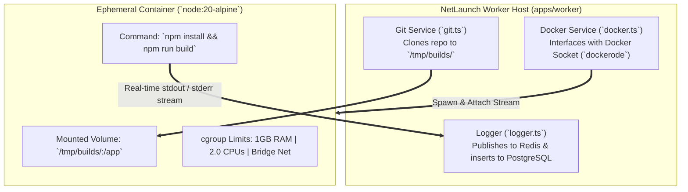

# 07. Isolated Docker Container Sandbox & Build Engine

## 1. Theory
When building multi-tenant cloud platforms (Vercel, Railway, Render), executing untrusted user code (`npm run build` / `npm install`) directly on host VMs creates catastrophic security risks: arbitrary code execution, host file system traversal, environment variable exfiltration, and resource starvation (e.g. infinite loops or memory leaks exhausting CPU/RAM).
To achieve true multi-tenancy and zero-trust security, `apps/worker` executes every project build inside an ephemeral, resource-bound Docker container sandbox (`node:20-alpine`) managed via Linux cgroups and namespaces.

## 2. Internal Working
When `apps/worker` pops a deployment job, `WorkerGitService` clones the repository into a dedicated host directory (`/tmp/netlaunch/builds/<deploymentId>`). `WorkerDockerService` checks if `node:20-alpine` exists locally (pulling if necessary), creates an ephemeral container mounting the host workspace read-write into `/app`, and injects project environment variables (`PROJECT_NAME`, user-defined `envVars`).
The container runs the command `sh -c "<installCommand> && <buildCommand>"`. `dockerode` attaches a real-time multiplexed stream (`stdout`/`stderr`), which `workerDocker` strips of binary headers and routes line-by-line to `workerLogger`. Once the container exits, `workerDocker` removes it (`container.remove({ force: true })`). If the Docker daemon is unreachable during local development, `WorkerDockerService` seamlessly falls back to local child process execution (`execAsync`) so local testing remains uninterrupted.

## 3. Architecture


## 4. Database Design
The `Deployment` model tracks exact execution metrics:
```prisma
model Deployment {
  id               String           @id @default(uuid())
  status           DeploymentStatus @default(QUEUED) // QUEUED -> BUILDING -> READY | FAILED
  durationMs       Int?             // Exact container execution duration in milliseconds
  startedAt        DateTime?
  finishedAt       DateTime?
  // ... relations to Project and BuildLog
}
```

## 5. APIs & Container Parameters
### Docker Container Specs
- **Image**: `node:20-alpine` (configurable via `env.DOCKER_BUILDER_IMAGE`)
- **Memory Limit**: `1024 MB` (`Memory: 1024 * 1024 * 1024`)
- **Swap Limit**: `1024 MB` (disabled swap overflow)
- **CPU Quota**: `2000000000 NanoCPUs` (2.0 CPUs maximum)
- **Network Mode**: `bridge` (allows external package registry access during `npm install`, but isolated from internal host loopback services).

## 6. Code Structure
- **`apps/worker/src/services/docker.ts`**: Implements `WorkerDockerService`, container creation, stream attaching/multiplex header stripping, and local fallback handling.

## 7. Security
- **No Metadata Access**: By using `bridge` network mode without host networking (`--net=host`), containers cannot access internal AWS EC2 metadata endpoints (`169.254.169.254`) or host Redis/PostgreSQL directly.
- **Ephemeral Volumes**: Containers are spawned with `--rm` behavior and removed explicitly in `finally` blocks.

## 8. Scaling
- **Builder Image Pre-caching**: In Kubernetes or AWS ECS production environments, worker nodes pre-pull base builder images (`node:20-alpine`, `python:3.11-alpine`) during node initialization so zero build time is wasted on image downloads.
- **Dedicated Build Pools**: Separate high-memory build workers (for large Next.js/Webpack compilations) from lightweight static site workers.

## 9. Interview Discussion
- **Q: How do you prevent a malicious dependency during `npm install` from attacking the host machine or other tenants?**
  - **A**: The build runs inside an isolated `node:20-alpine` Docker container with strict cgroup memory caps (1GB) and CPU quotas. The container runs in unprivileged bridge network mode without access to host sockets or cloud metadata services. When the build ends, the container is destroyed immediately (`container.remove`), ensuring zero state contamination between jobs.

## 10. Production Improvements
- **pnpm Content-Addressable Cache Mounting**: Mount a shared, read-only host volume cache (`/var/cache/pnpm:/root/.local/share/pnpm/store`) into the build container so `pnpm install` completes in under 2 seconds by hardlinking packages instead of downloading across the network each build.
