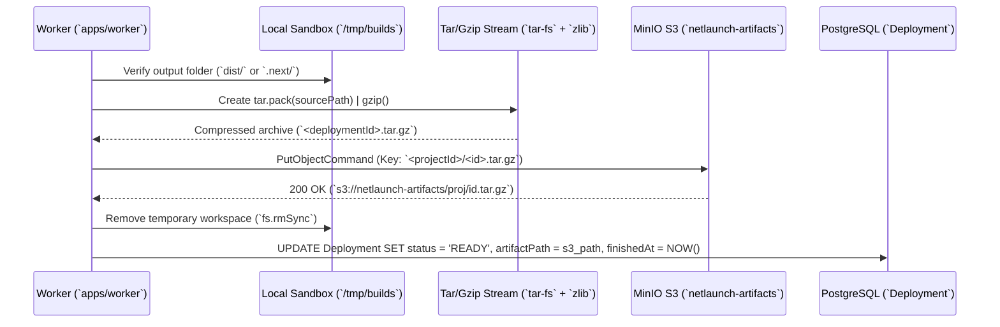

# 08. MinIO / S3 Artifact Bundling & Object Storage

## 1. Theory
Once a framework build completes (generating `dist/`, `.next/`, or `build/`), the resulting static assets and server bundles must be detached from the ephemeral build node (`apps/worker`) and persisted centrally. In production platforms, build artifacts are packaged into compressed tarball bundles (`.tar.gz`) and uploaded to highly available object storage (`AWS S3`, `Cloudflare R2`, or self-hosted `MinIO`). When an incoming user request arrives at the edge proxy ingress (`apps/proxy`), the proxy fetches the `.tar.gz` bundle from S3, extracts it into edge memory or local disk, and serves the static files or boots the serverless runtime instantly.

## 2. Internal Working
When `WorkerDockerService` finishes container execution with exit code `0`, `DeploymentWorkerService` invokes `WorkerMinioService.packageAndUploadArtifact()`.
`minio.ts` verifies that the project output directory (`dist` or `.next`) exists inside `/tmp/netlaunch/builds/<deploymentId>`. Using `tar-fs` and `zlib.createGzip()`, it streams the entire output directory into a compressed archive (`/tmp/artifacts/<deploymentId>.tar.gz`).
Using the AWS SDK (`@aws-sdk/client-s3`), `minio.ts` connects to our local `MinIO` instance (`http://localhost:9000`), verifies or creates the `netlaunch-artifacts` bucket, and uploads the bundle under key `<projectId>/<deploymentId>.tar.gz`. Upon completion, it deletes the workspace directory and marks the database `Deployment` record as `READY`.

## 3. Architecture


## 4. Database Design
```prisma
model Deployment {
  id           String           @id @default(uuid())
  status       DeploymentStatus @default(QUEUED)
  artifactPath String?          // e.g. "s3://netlaunch-artifacts/abc-project/deploy-123.tar.gz"
  url          String?          // e.g. "my-portfolio.netlaunch.app"
  durationMs   Int?
}
```

## 5. APIs & Storage Schema
### MinIO / S3 Configuration (`env.ts`)
- **Endpoint**: `http://localhost:9000` (`S3_ENDPOINT`)
- **Bucket**: `netlaunch-artifacts` (`S3_BUCKET`)
- **Object Key Convention**: `${projectId}/${deploymentId}.tar.gz`
- **Content Type**: `application/gzip`

## 6. Code Structure
- **`apps/worker/src/services/minio.ts`**: `WorkerMinioService` implementing stream-based tarball compression (`tar.pack().pipe(gzip)`), MinIO bucket validation (`HeadBucketCommand` / `CreateBucketCommand`), and S3 `PutObjectCommand` upload with local file system fallback during offline dev.

## 7. Security
- **Strict IAM Key Scoping**: In production AWS or R2 environments, `apps/worker` uses an IAM Role or Access Key restricted strictly to `s3:PutObject` on the `netlaunch-artifacts` bucket (`arn:aws:s3:::netlaunch-artifacts/*`), preventing workers from deleting historical builds or accessing other buckets.

## 8. Scaling
- **Streaming Compression**: By piping `tar.pack(sourceDir)` directly through `zlib.createGzip()` to a write stream (`pipe(output)`), memory consumption remains constant (~15MB buffer) even when compressing massive 2GB Next.js or monorepo build outputs.
- **Multipart S3 Uploads**: For artifact bundles exceeding 100MB, `@aws-sdk/lib-storage` (`Upload`) can split the tarball into concurrent 10MB chunks for multi-gigabit upload velocity.

## 9. Interview Discussion
- **Q: Why compress and upload artifacts as `.tar.gz` instead of uploading thousands of individual static files (`index.html`, `main.js`, `style.css`) directly to S3?**
  - **A**: Uploading 10,000 individual files from a large Next.js output over HTTP REST to S3 takes minutes due to round-trip latency and S3 API rate limits (`PUT` cost per object). Compressing the directory into a single `.tar.gz` stream completes in seconds, reduces network payload by 70%, and requires only a single `PutObject` request. When edge servers boot, downloading and decompressing one contiguous tarball is orders of magnitude faster.

## 10. Production Improvements
- **Content-Addressable Asset De-duplication**: Calculate SHA-256 hashes for individual static assets (`chunks/*.js`) and store them in a shared deduplicated blob pool (`netlaunch-blobs/<sha256>`). If multiple deployments or branches produce the same vendor JS chunk, store only one copy and reference it in an index manifest (`manifest.json`), cutting storage costs by 80%.
