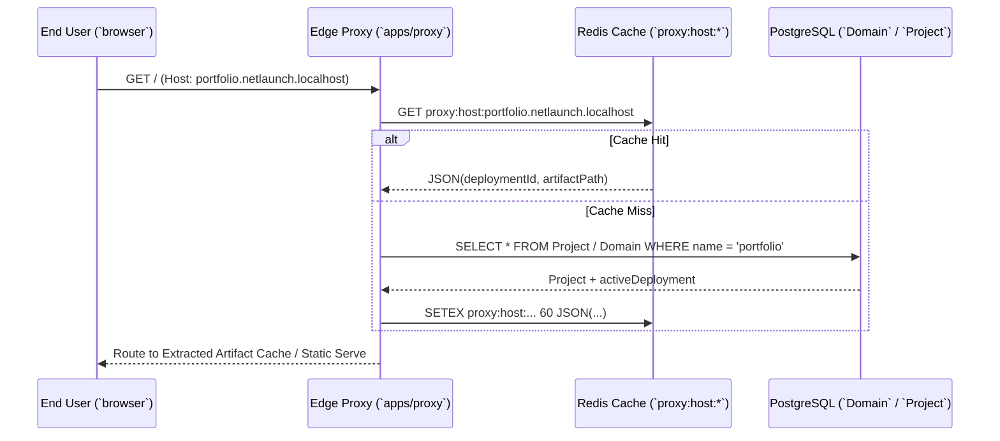

# 09. Edge Reverse Proxy & Subdomain Routing

## 1. Theory
When users access deployed web applications (e.g., `next-portfolio.netlaunch.localhost` or `portfolio.com`), traffic does not hit the primary control plane API (`apps/api`) nor the background build worker (`apps/worker`). In scalable cloud architectures (Vercel, Cloudflare, Netlify), a dedicated, highly concurrent Edge Reverse Proxy (`apps/proxy`) sits at the ingress point. The proxy intercepts the `Host` HTTP header, resolves the hostname to the active `Deployment` ID, fetches the compiled bundle from object storage (`MinIO`/`S3`), and serves static files or routes dynamic requests with sub-millisecond edge latency.

## 2. Internal Working
When an HTTP request arrives (`GET /` with `Host: next-portfolio.netlaunch.localhost`), `apps/proxy` extracts the hostname and checks an in-memory or Redis LRU cache (`proxy:host:next-portfolio.netlaunch.localhost`) for the associated `Deployment` record.
If missing from cache, `ProxyResolverService` queries PostgreSQL:
1. First, checking `Domain` table (`WHERE domainName = host`) for verified custom domains.
2. If no custom domain matches, extracting the subdomain prefix (`next-portfolio`) and querying `Project` (`WHERE name = prefix` or `subdomain = prefix`).
Once the active `Deployment` (`status === READY`) and its `artifactPath` are discovered, the resolution mapping is cached in Redis for 60 seconds with TTL to prevent database hammer on high-traffic sites.

## 3. Architecture


## 4. Database Design
The `Domain` model allows both automatic wildcard subdomains and verified custom domains:
```prisma
model Domain {
  id           String    @id @default(uuid())
  domainName   String    @unique
  projectId    String
  project      Project   @relation(fields: [projectId], references: [id], onDelete: Cascade)
  isCustom     Boolean   @default(false)
  verified     Boolean   @default(true)
  createdAt    DateTime  @default(now())
  
  @@index([domainName])
}
```

## 5. APIs & Proxy Contracts
### Host Header Resolution Rules
- **Wildcard Subdomains**: Any request ending with `.netlaunch.localhost` or `.netlaunch.app` strips the base suffix (`portfolio.netlaunch.localhost` -> `portfolio`).
- **Custom Domains**: Exact match against `Domain.domainName` (`portfolio.ai`).
- **Control Plane Bypass**: Requests matching `api.netlaunch.localhost` or `app.netlaunch.localhost` can be routed directly to `apps/api` or `apps/web` if proxying all traffic on port 80.

## 6. Code Structure
- **`apps/proxy/src/services/resolver.ts`**: Encapsulates `Host` header parsing, Redis caching (`SETEX`), and atomic Prisma fallback queries.

## 7. Security
- **Strict Host Verification**: If a host header does not match any active project or verified domain, `apps/proxy` returns a clean, styled `404 Not Found (NetLaunch Deployment Not Found)` page rather than leaking server stack traces or directory listings.
- **DNS Rebinding Protection**: The resolver sanitizes hostnames against CRLF injection and rejects IP-direct headers when looking up domains.

## 8. Scaling
- **Multi-Region Edge Caching**: Because resolution lookups are cached in Redis and local memory, `apps/proxy` instances can be deployed across global geographic edge points (AWS CloudFront / Anycast nodes) without requiring cross-region database queries on every HTTP request.

## 9. Interview Discussion
- **Q: Why separate `apps/proxy` into an independent service rather than handling web routing inside `apps/api`?**
  - **A**: `apps/api` handles heavy control plane tasks: GitHub OAuth, database transactions, webhook processing, and WebSocket streaming. If millions of public end-users request static assets (`/index.html`, `/main.js`) through the control plane, the API thread pool becomes saturated, stalling project management and dashboard interactions. Isolating `apps/proxy` allows horizontal scaling of edge traffic independently from control plane operations.

## 10. Production Improvements
- **Stale-While-Revalidate Domain Cache**: When a deployment updates from `v1` to `v2`, rather than waiting 60 seconds for Redis TTL expiration, `apps/api` publishes a cache invalidation event over Redis PubSub (`proxy:cache:invalidate`), instructing all running proxy replicas to instantly purge the domain entry and serve the newest deployment right away.
