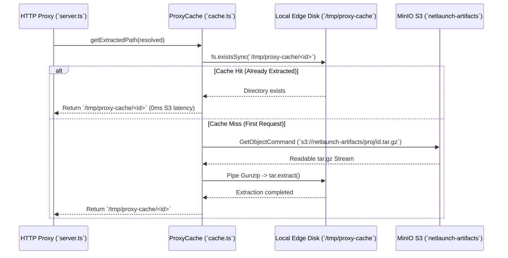

# 10. On-the-Fly S3 Artifact Extraction & Edge Caching

## 1. Theory
When an incoming HTTP request resolves to `deployment-uuid-123`, the edge reverse proxy (`apps/proxy`) must inspect whether the static files (`index.html`, `main.js`) are available locally. If the node started fresh or the deployment occurred on another worker, the files do not yet exist on disk. Instead of returning a `502 Bad Gateway`, the proxy performs **On-the-Fly S3 Artifact Extraction**: it pauses the incoming request stream (`await getAndExtractArtifact(...)`), downloads the `.tar.gz` bundle from MinIO/S3, extracts it directly into local edge storage (`/tmp/proxy-cache/uuid-123`), and immediately fulfills the pending HTTP response. Subsequent requests to that deployment hit local disk/memory with zero S3 overhead.

## 2. Internal Working
`ProxyCacheService` maintains an in-memory index (`Map<string, ExtractedArtifactCacheEntry>`) tracking every extracted deployment folder and its `lastAccessedAt` timestamp.
When `getExtractedPath(resolvedDeployment)` is invoked:
1. If the path exists in memory and on disk, `lastAccessedAt` is bumped to `Date.now()`, and the absolute folder path is returned instantly.
2. If missing on disk, `ProxyCacheService` parses `artifactPath` (`s3://netlaunch-artifacts/proj/deploy.tar.gz` or `file://...`). Using `@aws-sdk/client-s3` (`GetObjectCommand`), it streams the tarball through `zlib.createGunzip()` and `tar.extract(/tmp/proxy-cache/<deploymentId>)`.
3. Once extraction finishes (`extract.on('finish')`), the entry is recorded in the LRU tracking map and the path returned to the request handler.

## 3. Architecture


## 4. Database Design
The proxy cache is stateless relative to PostgreSQL; it relies strictly on the `artifactPath` string stored on `Deployment`:
```prisma
model Deployment {
  id           String           @id @default(uuid())
  status       DeploymentStatus
  artifactPath String?          // Source of truth for where the tarball lives
}
```

## 5. APIs & Storage Contracts
### Local Cache Directory
- **Base Directory**: `/tmp/netlaunch/proxy-cache` (or `PROXY_CACHE_DIR`)
- **Extracted Folder Structure**: `/tmp/netlaunch/proxy-cache/<deploymentId>/index.html` (or `_next/static/...`)
- **Max Disk Cache Size**: `5 GB` (LRU eviction triggers when exceeded)

## 6. Code Structure
- **`apps/proxy/src/services/cache.ts`**: `ProxyCacheService` implementing atomic tarball downloading (`s3.send(new GetObjectCommand)`), stream piping (`pipe(gunzip).pipe(extract)`), and LRU folder eviction (`evictOldestEntry()`).

## 7. Security
- **Path Traversal Prevention**: `tar.extract()` is configured or wrapped to verify that archive filenames (`entry.name`) do not contain `../` sequences that attempt to write files outside `/tmp/proxy-cache/<deploymentId>`.
- **Atomic Directory Swapping**: Extraction writes to a temporary staging folder (`/tmp/proxy-cache/<deploymentId>.tmp`) and renames (`fs.renameSync`) only upon full success, ensuring concurrent requests never read partially extracted HTML files.

## 8. Scaling
- **Promise De-duplication**: If 50 concurrent requests arrive for a newly deployed project (`id-123`) at the exact same millisecond before extraction finishes, `ProxyCacheService` coalesces all 50 callers onto a single shared `Promise<string>` (`pendingExtractions.get(id)`). Only one download stream executes from S3, and all 50 requests resolve simultaneously when complete.

## 9. Interview Discussion
- **Q: How do you prevent local proxy disk (`/tmp`) from running out of space when thousands of deployments are extracted over weeks?**
  - **A**: `ProxyCacheService` implements an LRU (Least Recently Used) disk eviction policy. After each new extraction, if total cached directory size exceeds the threshold (e.g., 5GB), the service sorts `cacheIndex` by `lastAccessedAt` ascending and deletes (`fs.rmSync`) the oldest unaccessed deployment directories until disk utilization drops below safety thresholds. If a user visits an evicted deployment later, the proxy simply re-extracts it from S3 on demand.

## 10. Production Improvements
- **Brotli Pre-compression**: During extraction, automatically generate `.br` and `.gz` static counterparts for text files (`.html`, `.js`, `.css`). When browsers send `Accept-Encoding: br`, `apps/proxy` serves the pre-compressed file directly (`index.html.br`), eliminating CPU compression overhead and saving 20% bandwidth over Gzip.
